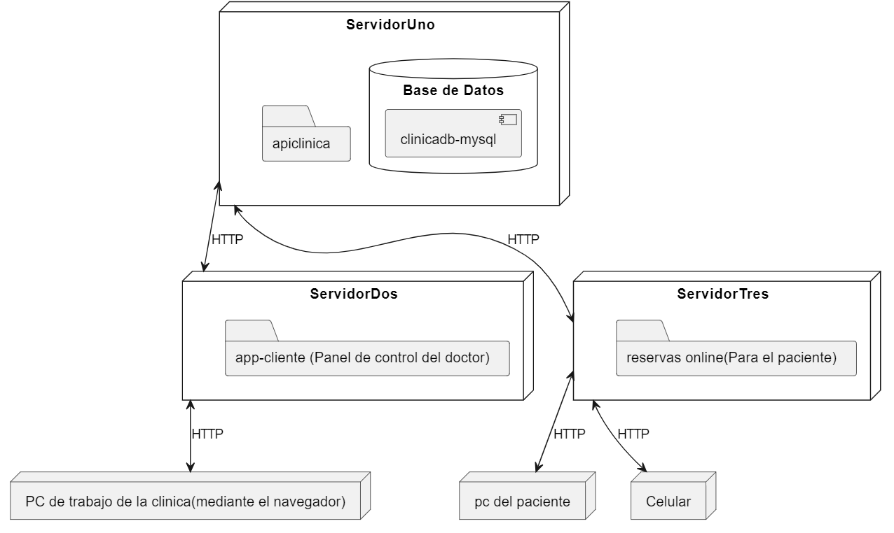

# Sistema de Gestión Clínica

Este repositorio contiene el código fuente y la documentación para un sistema de gestión clínica, diseñado para facilitar la administración de una clínica médica. El sistema consta de varios componentes interconectados que permiten a los médicos y pacientes interactuar de manera eficiente.

## Arquitectura del Sistema

El sistema se compone de los siguientes elementos principales:

### ServidorUno

Este servidor alberga la lógica de negocio para la aplicación clínica principal. Contiene una carpeta llamada "apiclinica" que contiene los archivos relacionados con la API de la clínica.

Además, ServidorUno tiene una base de datos denominada "Base de Datos", específicamente la instancia `[clinicadb-mysql]`, que almacena la información fundamental del sistema.

### ServidorDos

Este servidor aloja la aplicación cliente, que es un panel de control destinado al uso exclusivo de los médicos. Proporciona funcionalidades específicas para la gestión interna de la clínica.

### ServidorTres

Este servidor está dedicado a las reservas en línea, ofreciendo a los pacientes la posibilidad de realizar citas médicas de manera remota. Contiene una carpeta llamada "reservas online".

### Workstation

Se refiere a las estaciones de trabajo dentro de la clínica, donde los médicos y el personal administrativo acceden al sistema a través de un navegador web. Estas estaciones se comunican con ServidorDos para acceder al panel de control del doctor y con ServidorTres para gestionar las reservas en línea.

### PC del Paciente y Celular

Los pacientes acceden al sistema a través de sus propios dispositivos, ya sea una PC o un teléfono celular. Se conectan directamente con ServidorTres para realizar reservas en línea.

## Interconexiones

El sistema está diseñado para comunicarse a través de HTTP de la siguiente manera:

- **ServidorUno <-> ServidorDos:** Comunicación HTTP para proporcionar funcionalidades específicas del médico.
- **ServidorUno <-> ServidorTres:** Comunicación HTTP para gestionar las reservas en línea.
- **ServidorTres <-> PC del Paciente:** Comunicación HTTP para que los pacientes realicen reservas en línea desde su PC.
- **ServidorTres <-> Celular:** Comunicación HTTP para que los pacientes realicen reservas en línea desde sus dispositivos móviles.

## Requisitos del Sistema

Para ejecutar el sistema de gestión clínica, se requiere:

- Servidores con capacidad para ejecutar las aplicaciones y alojar las bases de datos correspondientes.
- Navegadores web modernos en las estaciones de trabajo de la clínica y en los dispositivos de los pacientes.
- Conexión a Internet para permitir la comunicación entre los diferentes componentes.

## Instalación y Uso

1. Clona este repositorio en tu entorno de desarrollo.
2. Configura y despliega cada componente del sistema según las instrucciones proporcionadas en sus respectivas carpetas.
3. Accede a la aplicación desde un navegador web en las estaciones de trabajo de la clínica o en los dispositivos de los pacientes.
4. ¡Disfruta de las funcionalidades del sistema de gestión clínica!

## Contribución

Las contribuciones son bienvenidas. Si deseas mejorar el sistema de gestión clínica, por favor, sigue estos pasos:

1. Crea un fork de este repositorio.
2. Crea una rama con una descripción clara de tu mejora.
3. Realiza los cambios necesarios y prueba exhaustivamente.
4. Envía un pull request describiendo los cambios realizados.

## Contacto

Para cualquier pregunta o sugerencia, no dudes en ponerte en contacto con el equipo de desarrollo a través de los problemas (issues) de este repositorio.

---

Este README proporciona una visión general del proyecto y su arquitectura. Para obtener información detallada sobre cómo configurar y desplegar cada componente, consulta la documentación específica dentro de cada carpeta del proyecto. ¡Gracias por tu interés y contribución al sistema de gestión clínica!
